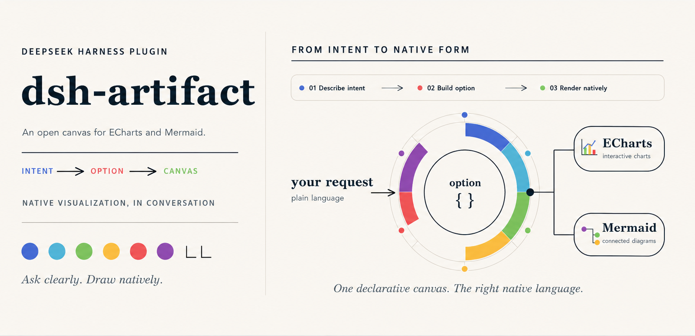
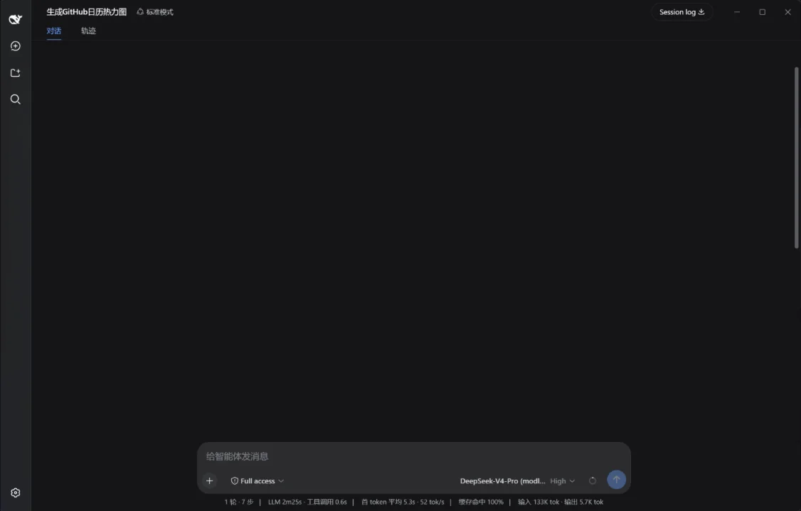

<p align="center">
  
</p>


<p align="center"><strong>让用户在 DeepSeek Harness 中，通过自然语言获得原生、交互式的 ECharts 与 Mermaid 绘图体验。</strong></p>

<p align="center">
  <a href="LICENSE"></a>
  
  
  
</p>

<p align="center"><a href="README.md">English</a></p>

<p align="center">
  
</p>

## 项目定位

`dsh-artifact` 是 DeepSeek Harness 的可视化渲染器。用户只需用自然语言描述想要的图表或图，模型理解意图、选择合适的原生引擎并生成声明式 payload，结果会直接以交互式画布出现在对话中。

它提供的是接近原生 ECharts 与 Mermaid 的绘图体验，而不是一组手绘、能力有限的图表模板。浏览器接收真实的 ECharts option 或 Mermaid 源码，并交给真实引擎渲染。

```text
用户指令  →  模型理解意图  →  ECharts option / Mermaid 源码  →  对话内交互画布
```

## 核心能力

### 从一句指令到原生画布

只需用自然语言描述想要的可视化，`dsh-artifact` 就能在同一段对话中完成整个过程：模型理解需求、生成原生引擎 payload，并将结果渲染为支持外观切换和 PNG 下载的交互式画布。

<p align="center">
  <a href="https://raw.githubusercontent.com/sumarilkkxx/dsh-artifact/master/assets/dsh-artifact-workflow.webp" target="_blank" rel="noopener noreferrer" title="在新标签页中打开完整动图">
    
  </a>
</p>

<p align="center"><sub>一次请求，从流式思考和工具调用，到原生 ECharts 日历热力图。演示完整保留 DeepSeek Harness 的真实界面。</sub></p>


### 基于真实渲染引擎

| | 能力 |
|---|---|
| **原生渲染引擎** | ECharts 6、仅在 option 需要时按需启用的官方 ECharts-GL 扩展，以及 Mermaid 11 |
| **广泛的 ECharts 覆盖** | 原生 JSON 可表达的 series / component：笛卡尔、饼图、雷达、日历热力图、关系图、桑基图、树图、地图、平行坐标、时间轴、`dataset`、`visualMap`、`dataZoom` 等 |
| **Mermaid 图表与图** | 流程图、时序图、类图、状态图、ER 图、甘特图、旅程图、饼图及 Mermaid 支持的其他图形 |
| **交互式画布** | tooltip、图例、缩放、拖拽、3D 控制和响应式尺寸均由实际渲染引擎提供 |
| **外观控制** | 画布内可切换 ECharts 风格主题和深/浅背景；真实贴图地球只提供背景切换，不篡改地理表面颜色 |
| **PNG 下载** | ECharts、ECharts-GL 和 Mermaid 画布均可按当前背景导出 2× PNG；标准 ECharts 图表和 Mermaid 图还支持 SVG 下载 |
| **安全边界** | 声明式通道全程纯 JSON；自定义 HTML 运行在 CSP 限制的沙箱 iframe 中 |

## 安装

请先安装 DeepSeek Harness CLI（仅需一次）：

```sh
npm install -g @deepseek-ai/dsh
```

如果你第一次使用 DSH，请先运行一次 `dsh web` 初始化 Web profile，然后停止该进程，再继续安装插件。

```sh
# 从 GitHub 安装（推荐；仓库已包含构建好的引擎资产）
dsh plugin --profile web add github:sumarilkkxx/dsh-artifact

# 本地开发
dsh plugin --profile web add link:/path/to/dsh-artifact
```

启动或重启 `dsh web` 后，在浏览器强制刷新（`Cmd/Ctrl+Shift+R`）。系统需要将 `pnpm` 加入 `PATH`，因为 DSH 的插件命令会在内部使用它。

## 直接用自然语言绘图

例如直接对模型说：

> 对比 2024 年各季度营收和利润率，生成双 Y 轴图，突出表现最好的季度，并使用深色画布。

> 生成一张 GitHub 风格的年度每日提交日历热力图。

> 画一个 OAuth 登录的时序图，包含成功与失败分支。

模型会调用 `render_artifact` 并返回对话内的真实画布。适用场景可通过画布内的**外观**切换主题/背景；旁边的**下载**按钮可保存 PNG 图片。

## 引擎契约

### `render_artifact`

| 参数 | 类型 | 说明 |
|---|---|---|
| `engine` | string | `echarts`（默认）或 `mermaid` |
| `option` | object / string | `echarts` 使用的原生 ECharts option；只能是纯 JSON，不能含 JavaScript 函数 |
| `maps` | object / string | ECharts `geo` / `map` 可选的合法 GeoJSON/SVG 注册表 |
| `code` | string | `mermaid` 使用的 Mermaid 源码 |
| `theme` | string | `auto`、`tech-blue`、`minimal`、`night-purple`、`forest` 或 `amber` |
| `mode` | string | `auto`、`light` 或 `dark` |
| `title` | string | 对话卡片标题 |
| `height` | number | 画布高度 px（默认 `360`，最小 `120`） |

插件会将 ECharts option 直接交给 `setOption`，而不是翻译为一个有限的预设图库。option 中明确写出的值会像 ECharts 原生行为一样优先于画布主题。需要 ECharts 3D option 时才加载官方 ECharts-GL；它仍是 ECharts 兼容层的一部分，而非独立的 3D 场景编辑器。

JavaScript 回调不能穿过 JSON 安全边界。formatter 等场景请优先使用 `{c}%` 这类 ECharts 字符串模板；确实必须使用回调的自定义交互，请使用 `render_html`。

### `render_html`

| 参数 | 类型 | 说明 |
|---|---|---|
| `html` | string | 自包含 HTML 片段或完整文档；允许内联 CSS / JS |
| `title` | string | 对话卡片标题 |
| `height` | number | 画布高度 px（默认 `400`，最小 `120`） |

`render_html` 是为特殊自定义组件预留的独立能力。它运行在不透明源 iframe 中，CSP 会阻止网络访问、顶层导航和表单提交。宿主无法安全读取其内容，因此这里不会提供 PNG 下载按钮。

## 原生 ECharts 示例

```json
{
  "engine": "echarts",
  "title": "2024 年季度营收",
  "mode": "dark",
  "option": {
    "tooltip": { "trigger": "axis" },
    "legend": { "top": 28 },
    "xAxis": { "type": "category", "data": ["Q1", "Q2", "Q3", "Q4"] },
    "yAxis": { "type": "value", "name": "营收（万元）" },
    "series": [{ "type": "bar", "name": "营收", "data": [120, 180, 150, 210] }]
  }
}
```

## 安全与兼容性

- 声明式 payload 会按无损 JSON 校验；函数、`undefined` 和 `symbol` 会被拒绝。
- 引擎资产仅从插件自己的路由提供，并阻止路径穿越。
- 地图必须在 `maps` 中提供具备合法使用权的 GeoJSON/SVG；插件绝不会从网络拉取地图数据。
- 插件随仓库提供本地引擎资产，ECharts 与 Mermaid 的渲染不依赖 CDN。

## 开发

```sh
npm install
npm run build

# 添加本地插件后，重启 dsh web 并强制刷新浏览器。
dsh plugin --profile web add .
```

| 路径 | 说明 |
|---|---|
| `index.js` | 宿主工具定义、校验、提示词引导和本地资产路由 |
| `client.js` | DeepSeek Harness toolview、引擎分发、外观控制和 PNG 导出 |
| `assets/` | 已提交的 ECharts、ECharts-GL、Mermaid 与项目媒体资产 |
| `docs/showcase/` | README 展示动效的源码与像素素材 |
| `scripts/build.mjs` | 将渲染器发行文件复制到 `assets/` |

插件不引入 `@deepseek-ai/*` 运行时依赖。ECharts、ECharts-GL 和 Mermaid 都是构建期依赖，只用于产出随仓库提交的本地资产。

## 路线图

- [x] 原生 ECharts 与 Mermaid 画布
- [x] 对原生 JSON ECharts 3D option 的 ECharts-GL 兼容
- [x] 深浅外观控制与 PNG 导出
- [x] 沙箱化 HTML 兜底能力
- [ ] 从画布回传模型的可选 action round-trip
- [ ] 更多声明式渲染引擎

## 参与贡献

欢迎贡献。请保持声明式通道无函数、维护沙箱边界，并在升级引擎版本时一并提交重新构建的资产。

## License

[MIT](LICENSE)
